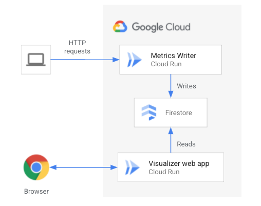

# GIG ハンズオン (Cloud Native)

## Google Cloud プロジェクトの選択

ハンズオンを行う Google Cloud プロジェクトを作成し、 Google Cloud プロジェクトを選択して **Start/開始** をクリックしてください。

**なるべく新しいプロジェクトを作成してください。**

<walkthrough-project-setup></walkthrough-project-setup>

<walkthrough-watcher-constant key="region" value="asia-northeast1"></walkthrough-watcher-constant>

## **環境準備**

<walkthrough-tutorial-duration duration=10></walkthrough-tutorial-duration>

最初に、ハンズオンを進めるための環境準備を行います。

下記の設定を進めていきます。

- gcloud コマンドラインツール設定
- Google Cloud 機能（API）有効化設定

## **gcloud コマンドラインツール**

Google Cloud は、コマンドライン（CLI）、GUI から操作が可能です。ハンズオンでは主に CLI を使い作業を行いますが、GUI で確認する URL も合わせて掲載します。

### **1. gcloud コマンドラインツールとは?**

gcloud コマンドライン インターフェースは、Google Cloud でメインとなる CLI ツールです。このツールを使用すると、コマンドラインから、またはスクリプトや他の自動化により、多くの一般的なプラットフォーム タスクを実行できます。

たとえば、gcloud CLI を使用して、以下のようなものを作成、管理できます。

- Google Compute Engine 仮想マシン
- Google Kubernetes Engine クラスタ
- Google Cloud SQL インスタンス

**ヒント**: gcloud コマンドラインツールについての詳細は[こちら](https://cloud.google.com/sdk/gcloud?hl=ja)をご参照ください。

### **2. gcloud から利用する Google Cloud のデフォルトプロジェクトを設定**

gcloud コマンドでは操作の対象とするプロジェクトの設定が必要です。操作対象のプロジェクトを設定します。

```bash
gcloud config set project {{project-id}}
```

承認するかどうかを聞かれるメッセージがでた場合は、`承認` ボタンをクリックします。

### **3. gcloud からの Cloud Run のデフォルト設定**

Cloud Run の利用するリージョン、プラットフォームのデフォルト値を設定します。

```bash
gcloud config set run/region {{region}}
gcloud config set run/platform managed
```

ここではリージョンを東京、プラットフォームをフルマネージドに設定しました。この設定を行うことで、gcloud コマンドから Cloud Run を操作するときに毎回指定する必要がなくなります。

<walkthrough-footnote>CLI（gcloud）で利用するプロジェクトの指定、Cloud Run のデフォルト値の設定が完了しました。次にハンズオンで利用する機能（API）を有効化します。</walkthrough-footnote>

## **参考: Cloud Shell の接続が途切れてしまったときは?**

一定時間非アクティブ状態になる、またはブラウザが固まってしまったなどで `Cloud Shell` が切れてしまう、またはブラウザのリロードが必要になる場合があります。その場合は以下の対応を行い、チュートリアルを再開してください。

### **1. チュートリアル資材があるディレクトリに移動する**

```bash
cd ~/gcp-getting-started-cloudrun
```

### **2. チュートリアルを開く**

```bash
teachme tutorial.md
```

### **3. gcloud のデフォルト設定**

```bash
gcloud config set project {{project-id}}
gcloud config set run/region {{region}}
gcloud config set run/platform managed
```

途中まで進めていたチュートリアルのページまで `Next` ボタンを押し、進めてください。

## [解説] ハンズオンの内容

### **概要**
このラボでは、いくつかの重要なクラウドネイティブ開発原則に基づいて Cloud Run を実装します。 ラボは各セクションに分かれています。 各セクションでは、特定のクラウドネイティブ原則を示すように Cloud Run サービスを構成します。

Cloud Native Computing Foundation（CNCF）の定義によると、「クラウドネイティブテクノロジーにより、組織は、パブリック、プライベート、ハイブリッドクラウドなどの最新の動的環境でスケーラブルなアプリケーションを構築および実行できます。コンテナ、サービスメッシュ、マイクロサービス、イミュータブルインフラストラクチャ、および 宣言型 API は、このアプローチの例です。これらの手法により、復元力、管理性、監視性を備えた疎結合システムが実現可能になります。堅牢な自動化と組み合わせることで、エンジニアは最小限の労力で頻繁かつ予測どおりに影響の大きい変更を行うことができます。」

次の図は、ラボの開始状態を示しています。 アーキテクチャは完全にサーバーレスです。 Cloud Firestore NoSQL データベースと相互作用するコンテナ化された Web サービスを Cloud Run にデプロイします。



このアーキテクチャは、2つのCloudRunサービスで構成されています。

Metrics writer

- メトリックを Cloud Firestore データベースに書き込むシンプルな「helloworld」スタイルのサービス。
- 各メトリックライターインスタンスは、1秒ごとにハートビートレコードを Cloud Firestore データベースに書き込みます。

> ハートビートレコードは、インスタンスがアクティブであるかどうか（要求を処理しているかどうか）、最後の1秒間に受信した要求の数、およびその他のメタデータを示します

Visualizer web app

- Cloud Run でホストされ、メトリックライターインスタンスによって永続化されたメトリックを読み取り、いい感じのグラフを表示するウェブアプリ。.

### **目的**
このラボでは、次のタスクを実行します。

- コンテナ化されたサービスを Cloud Run にデプロイします
- スケーリング動作を示すために Cloud Run に対して負荷を生成します
- ネットワークトラフィックを操作するためのロードバランサーとトラフィック分割ルールを構成します
- Cloud Run サービスへのアクセスを制限するように IAM とセキュリティルールを構成します。

## 1. Containers はユニバーサル
> **クラウドネイティブの原則**: コンテナは、クラウドネイティブソフトウェアにおける、標準化されたイミュータブルなユニットです。

このタスクでは、環境を設定し、最初のアーキテクチャをデプロイします。

- ビルド済みのコンテナイメージを使用して Cloud Run サービスを展開します。
- イメージが使用するプログラミング言語、Webフレームワーク、または依存関係は関係ありません。
- イメージは、標準化されたユニバーサルなフォーマットでパッケージ化されています。
- イメージは、変更することなく、さまざまなコンテナ実行環境に展開できます。

### 環境のセットアップ
1. `Cloud Shell` を開きます

2. このラボのスクリプトを含む git リポジトリをクローンします。 gcloud の承認を求められた場合は、承認してください。.

```bash
git clone https://github.com/google-cloud-japan/gig-training-materials.git
```

3. リポジトリディレクトリに移動します
```bash
cd gig04-3
```
<!-- シェルの中のリージョンを変更する必要あり <- done -->
4. スクリプトを実行して、プロジェクト ID とデフォルトリージョンのシェル変数を設定します。.
```bash
source vars.sh
```

5. デフォルトで Cloud Run のマネージド環境を利用するよう、 `gcloud` コマンドで設定します。
```bash
gcloud config set run/platform managed
```

6. 必要な API を有効にします
```bash
gcloud services enable run.googleapis.com \
  firestore.googleapis.com \
  appengine.googleapis.com \
  compute.googleapis.com
```

7. App Engine を初期化します。このラボでは App Engine を使用しませんが、次のステップで Firestore データベースを作成する前に App Engine を初期化する必要があります
```bash
gclou dapp create --region $REGION
```

8. Firestore データベースを作成します。
```bash
gcloud firestore databases create --region $REGION
```

### metrics-writer コンテナをローカルで実行する
ここでは、metrics-writer コンテナをローカルで実行します。公開されている Google Artifacts Registry からコンテナイメージを取得します。コンテナイメージは実行可能であり、完全に自己完結型です。すべてがイメージにパッケージ化されているため、依存関係やランタイム環境をインストールする必要はありません。

<!-- Source = https://source.cloud.google.com/cnaw-workspace/cloudrun-visualizer/+/master:README.md -->
1. metrics-writer コンテナイメージをローカルの Cloud Shell インスタンスにダウンロードします
```bash
docker pull asia-northeast1-docker.pkg.dev/gig4-3/gig4-3/metrics-writer:latest
```

2. イメージを実行します。プロジェクト ID に環境変数を設定し、ローカルポートをコンテナポートにマップします。
```bash
docker run \
  -e GOOGLE_CLOUD_PROJECT=${PROJECT_ID} \
  -p 8080:8080 \
  asia-northeast1-docker.pkg.dev/gig4-3/gig4-3/metrics-writer:latest
```

以下のような出力が表示されます

**Output**
```terminal
> hello-world-metrics@0.0.1 start /usr/src/app
> functions-framework --target=helloMetrics --source ./src/

Serving function...
Function: helloMetrics
Signature type: http
URL: http://localhost:8080/
```

3. 新しい Cloud Shell タブを開きます

4. 新しい Cloud Shell タブで、ローカルコンテナを呼び出します。
```bash
curl localhost:8080
```

以下のような出力が表示され、正常な応答を示しています。

**Output**
```terminal
Hello from blue
```

5. 最初の Cloud Shell タブに戻ります。メトリックスケジュールが開始していることが示されています。これらのログは無視してかまいません。

**Output**
```terminal
URL: http://localhost:8080/
initialising instance: 7229f512-6676-4211-90ca-80545c26aeb1
starting metrics schedule...
Metrics: id=7229f512, activeRequests=0,  requestsSinceLast=1
Metrics: id=7229f512, activeRequests=0,  requestsSinceLast=0
```

>Note: エラーが発生した場合は、しばらく待ってから、上記の手順（手順2から手順5）のコマンドを再実行してください。

6. control-c でローカル実行されているコンテナを停止します。

### 初期アーキテクチャのデプロイ

1. `metrics-writer` アプリを Cloud Run にデプロイします。Google Artifact Registry からのビルド済みコンテナイメージを使用します。
```bash
gcloud run deploy metrics-writer \
  --concurrency 1 \
  --allow-unauthenticated \
  --image asia-northeast1-docker.pkg.dev/gig4-3/gig4-3/metrics-writer:latest
```

以下のような出力が表示されます

**Output**
```terminal
Deploying container to Cloud Run service [metrics-writer] in project [gig4-3] region [asia-northeast1]
OK Deploying new service... Done.
  OK Creating Revision... Revision deployment finished. Checking container health.
  OK Routing traffic...
  OK Setting IAM Policy...
Done.
Service [metrics-writer] revision [metrics-writer-00001-ras] has been deployed and is serving 100 percent of traffic.
Service URL: https://metrics-writer-rmclwajz3a-an.a.run.app
```

2. metrics-writer サービスの URL の値を使用してシェル変数を設定します
```bash
export WRITER_URL=$(gcloud run services describe metrics-writer --format='value(status.url)')
```

3. metrics-writer サービスと対話できることを確認します。 [SERVICE_URL] を前のコマンドの出力からのサービス URL の値に置き換えます。
```bash
curl $WRITER_URL
```

以下のような出力が表示されます

**Output**
```terminal
Hello from blue
```

4. `visualizer`　アプリを Cloud Run にデプロイします。ここでも、Google Artifact Registry から事前に作成されたコンテナイメージを使用します。
```bash
gcloud run deploy visualizer \
  --allow-unauthenticated \
  --max-instances 5 \
  --image asia-northeast1-docker.pkg.dev/gig4-3/gig4-3/visualizer:latest
```

5. visualizer サービスは Web アプリです。ローカルマシンで、Web ブラウザを開いてサービス URL にアクセスし、deploy コマンドの出力から URL 値をコピーします。

以下のような空のグラフが表示されます:


6. Cloud Run サービスを一覧表示します。metrics-writer と visualizer の2つのサービスが表示されます。
```bash
gcloud run services list
```

You see output like below

**Output**
```terminal
✔
SERVICE: metrics-writer
REGION: asia-northeast1
URL: https://metrics-writer-rmclwajz3a-an.a.run.app
LAST DEPLOYED BY: admin@hiroyukimomoi.altostrat.com
LAST DEPLOYED AT: 2022-06-09T02:12:43.845980Z

✔
SERVICE: visualizer
REGION: asia-northeast1
URL: https://visualizer-rmclwajz3a-an.a.run.app
LAST DEPLOYED BY: admin@hiroyukimomoi.altostrat.com
LAST DEPLOYED AT: 2022-06-09T04:38:29.682058Z
```

7. [Cloud Run セクション](https://console.cloud.google.com/run) にアクセスして、サービスの内容を確認します。

## 2. Scale-out ready

>**Cloud native principle: cloud native apps are stateless, disposable and engineered for fast, automatic scaling.

In this module you generate request traffic against the metrics-writer Cloud Run service to demonstrate autoscaling behavior. You then modify the service's configuration to see the impact on scaling behavior.


### Cloud Run container instance autoscaling

In Cloud Run, each active [revision](https://cloud.google.com/run/docs/resource-model#revisions) is automatically scaled to the number of container instances needed to handle incoming requests. Refer to the [instance autoscaling](https://cloud.google.com/run/docs/about-instance-autoscaling) docs for more details.

The number of instances created is impacted by:
- The CPU utilization of existing instances (Targeting to keep serving instances to a 60% CPU utilization)
- The [concurrency setting](https://cloud.google.com/run/docs/about-concurrency)
- The [maximum number of container instances setting](https://cloud.google.com/run/docs/configuring/max-instances)
- The [minumum number of container instances setting](https://cloud.google.com/run/docs/configuring/min-instances)

### Generate request traffic

1. Open Cloud Shell. If your previous shell was inactive for some time, you may need to reconnect. If so, after reconnecting, change into the repo directory and set the environment variables again.
```bash
cd ~/gig-training-materials/gig04-3/ && source vars.sh && export WRITER_URL=$(gcloud run services describe metrics-writer --format='value(status.url)')
```

2. List the Cloud Run services.
```bash
gcloud run services list
```

3. If you do not have one open already, one a web browser page to the url of the visualizer service.

4. Use the [hey](https://github.com/rakyll/hey) command-line utility to generate request traffic against the service for 30 seconds, using 30 workers. The `hey` utility is already installed in Cloud Shell.
```bash
hey -z 30s -c 30 $WRITER_URL
```

5. Switch to the browser page that displays the visualizer web app. You see a graph plotted on the page. Cloud Run has rapidly scaled the number of active instances to serve the traffic volume.


6. Watch the graph until the end of 30 seconds. Cloud Run rapidly scales down to zero instances. Make a mental note of the peak number of active instances.

7. Return to cloud shell. The `hey` utility outputs a summary of the load test. Look at the summary metrics and response time histogram.


8. Visit the [Cloud Run section](https://console.cloud.google.com/run) of the cloud console. Click into the `metrics-writer` service, and then select the 'Metrics' tab.

<image />

You see that Cloud Run provides some useful [monitoring metrics] out-of-the-box, such as request count, request latencies, container instance count, and more.

9. Change the time period to '1 hour' and look at the 'container instance count' graph. The peak 'active' instances value should match approximately the value you saw in the visualizer graph. You need to wait approximately 3 minutes for the graphs to update.

>Note: the Metrics tab in the Cloud Console provides the most accurate information about your Cloud Run service. This information comes from Cloud Monitoring. However, the metrics in the console take approximately 3 minutes to update. In this lab, you use the visualizer graph to show real-time scaling. The visualizer is for demo purposes only.

### Update service concurrency

Cloud Run provides a [concurrency]() setting that specifies the maximum number of requests that can be processed simultaneously by a given container instance.

If your code cannot process parallel requests, set `concurrency=1`. Each container instance will handle only 1 request at a time, as in the diagram on the left.

If your container can handle multiple requests simultaneously, set a higher concurrency. The specified concurrency value is a _maximum_ and Cloud Run might not spend as many requests to a given container instance if the CPU of the instance is already highly utilized. In the diagram on the right, the service is configured to handle a maximum of 80 simultaneous requests(the default). Cloud Run therefore sends all 3 requests to a single container instance.


You deployed the metrics-writer service with an initial setting of `concurrency=1`. This means that each container instance will process only a single request at a time. You used this value to demonstrate Cloud Run's fast autoscaling. However, a simple service like this can probably handle a much higher concurrency. Here, you increase the concurrency setting and investigate the impact on scaling behavior.

1. Update the metrics-writer service's concurrency setting. This creates a new revision for the service. All requests are routed to this new revision once it is ready.
```bash
gcloud run services update metrics-writer \
  --concurrency 5
```

2. Rerun the command to generate request load
```bash
hey -z 30s -c 30 $WRITER_URL
```

3. Switch back to the browser page that displays the visualizer web app. You see another graph plotted on the page.


4. Inspect the `hey` output summary.


### Update service max-instances configuration

Here, you use the [maximum container instances]() setting to limit the scaling of your service in response to incoming requests. Use this setting as a way to control your costs or to limit the number of connections to a backing service, such as to a database.

1. Update the metrics-writer service's max-instances setting
```bash
gcloud run services update metrics-writer \
  --max-instances 5
```

2. Rerun the command to generate request load
```bash
hey -z 30s -c 30 $WRITER_URL
```

3. Switch back to the browser page that displays the visualizer web app. You see another graph plotted on the page.

4. Inspect the `hey` output summary. How does it compare to the previous output?

## 3. Nimble traffic

>_**Cloud native principle**: Cloud-native apps have a programmable network data plane._

In this section you configure Cloud Run traffic splitting and ingress rules. You program this network behavior using simple API calls.


### Deploy a tagged version

You can assign a named tag to a new revision that allows you to access the revision at a specific URL, without service traffic. You can then use that tag to gradually migrate traffic to the tagged revision, and to rollback a tagged revision. A common use case for this feature is to use it for testing and vetting of a new service revision before it serves any traffic.

1. Open Cloud Shell. If your previous shell was inactive for some time, you may need to reconnect. If so, after reconnecting, change into the repo directory and set the environment variables again.

```bash
cd ~/gig-training-materials/gig04-3/ && source vars.sh && export WRITER_URL=$(gcloud run services describe metrics-writer --format='value(status.url)')
```

2. Deploy a new revision for the metrics-writer service, setting the concurrency and max-instances values back to known values.
```bash
gcloud run services update metrics-writer \
  --concurrency 5 \
  --max-instances 7
```

3. Deploy a new revision of the metrics-writer service. You specify a tag called 'green'. You set the `--no-traffic` flag, which means that no traffic is routed to the new revision. You set the LABEL environment variable, which controls the color of the displayed graph (note that the environment variable is totally unrelated to the tag).
```bash
gcloud beta run deploy metrics-writer \
  --tag green \
  --no-traffic \
  --set-env-vars LABEL=green \
  --image asia-northeast1-docker.pkg.dev/gig4-3/gig4-3/metrics-writer:latest
```

You see output like below. Note the revision is serving 0 percent of traffic, and that it has a dedicated URL prefixed with the tag name.

You see output like below

**Output (do not copy)**
```
Deploying container to Cloud Run service [metrics-writer] in project [gig4-3] region [asia-northeast1]
OK Deploying... Done.
  OK Creating Revision...
  OK Routing traffic...
Done.
Service [metrics-writer] revision [metrics-writer-00005-don] has been deployed and is serving 0 percent of traffic.
The revision can be reached directly at https://green---metrics-writer-rmclwajz3a-an.a.run.app
```

4. The previous command output the dedicated tagged url for the new 'green' revision. Set a shell variable, replacing [TAGGED_URL] with the value from the command output.
```bash
export GREEN_URL=[TAGGED_URL]
```

5. List the service revisions. You see there are two active revisions.
```bash
gcloud run revisions list --service metrics-writer
```

6. Perform a request to the service. Run the command several times. You see that the service always returns "blue". The green service is not serving traffic from the primary service URL.
```bash
curl $WRITER_URL
```

7. Perform a request against the new tagged URL. You see that the service returns "green". The main revision is still serving all live traffic, but you now have a tagged version with a dedicated URL you can test against.
```bash
curl $GREEN_URL
```

**Output (do not copy)**
```
Hello from green
```

### Configure a traffic split

Cloud Run allows you to specify which revisions or tags should receive traffic, and to specify traffic percentages that are received by a revision. This feature allows you to rollback to a previsou revision, gradually roll out a revision, and split traffic between multiple revisions.

1. Configure a traffic split, sending 10% of traffic to the revision tagged 'green'
```bash
gcloud beta run services update-traffic \
  metrics-writer --to-tags green=10
```

You see output like below. The output describes the current traffic configuration.

**Output (do not copy)**
```
OK Updating traffic... Done.
  OK Routing traffic...
Done.
URL: https://metrics-writer-rmclwajz3a-an.a.run.app
Traffic:
  90% metrics-writer-00004-wof
  10% metrics-writer-00005-don
        green: https://green---metrics-writer-rmclwajz3a-an.a.run.app
```

2. Generate request load against the metrics-writer service. You see the main service URL.
```bash
hey -z 30s -c 30 $WRITER_URL
```

3. Switch back to the browser page that displays the visualizer web app. You see a graph plotted on the page. The graph has two lines, one green and one blue. The 'green' service is receiving approximately 10% of traffic


4. Configure another traffic split, now sending 50% of traffic to the revision tagged 'green'
```bash
gcloud beta run services update-traffic \
  metrics-writer --to-tags green=50
```

5. Generate request load against the metrics-writer service.
```bash
hey -z 30s -c 30 $WRITER_URL
```

6. Switch back to the browser page that displays the visualizer web app. This time the traffic is split evenly between the green and blue revisions.

### Create an external HTTP(S) load balancer

In this section you create an [external HTTP(S) load balancer](https://cloud.google.com/load-balancing/docs/https). Google Cloud HTTP(S) Load Balancing is a global, proxy-based Layer 7 load balancer that enables you to run and scale your services worldwide behind a single external IP address. You use a [serverless network endpoint group](https://cloud.google.com/load-balancing/docs/negs/serverless-neg-concepts)(NEG) to route requests from the load balancer to your Cloud Run service.

>WORNING: for simplicity, you create a HTTP (not HTTPS) load balancer. This way, you don't have to set up certificates. In production, you should use a HTTPS load balancer.

>NOTE: creating a load balancer involves several steps. FOr convenience, here you use Terraform to create the load balancer and related components.

1. In the gig04-3 repo directory, initialize Terraform.
```bash
terraform init
```

2. Apply the Terraform to create the load balancer and related components. You configure a serverless NEG that routes requests from the load-balancer to the metrics-writer Cloud Run Service.
```bash
terraform apply -auto-approve -var project_id=$PROJECT_ID
```

The final line of the Terraform output should be similar to below:

**Output (do not copy)**
```
Apply complete! Resources: 7 added, 0 changed, 0 destroyed.
```

3. List th eforwarding rule that specifies the external IP address of the load balancer
```bash
gcloud compute forwarding-rules list
```

You see output like below

**Output (do not copy)**
```
NAME: lb-http
REGION:
IP_ADDRESS: 34.110.187.86
IP_PROTOCOL: TCP
TARGET: lb-http-http-proxy
```

4. Set a shell variable for the load balancer IP address, replacing [IP_ADDRESS] with the value from the previous output
```bash
export LB_IP=[IP_ADDRESS]
```

5. Wait **1 minute** for the load balancer to come fully online.

6. Perform a HTTP GET request to the load balancer address. If you get a 404 error, wait a little more fo rthe load balancer to be ready.
```bash
curl $LB_IP
```

You see a response from the metrics-writer service. HTTP requests to the load balancer are being routed to the metrics-writer service. As your traffic split is still active, you might see either 'green' or 'blue'

**Output (do not copy)**
```
Hello from blue
```

### Apply ingress rules

You deployed the metrics-writer Cloud Run service with the `--allow-unauthenticated` flag. This makes the service URL publicly accessible on the internet. Anyone can interact directly with your sercie.

In this section, you set [ingress rules](https://cloud.google.com/run/docs/securing/ingress) on the Cloud Run service to reject any requests that do not originate from the load balancer, or from inside your project's VPC network. This way, the Cloud Run servicer URL is not publicly accessible on the internet.

By forcing all requests through the load balancer, you can also take advantage of additional load balancer features such as [Cloud Armor](https://cloud.google.com/armor) and [Cloud CDN](https://cloud.google.com/cdn).

1. Verify that you can still interact with the metrics-writer service via it's service URL
```bash
curl $WRITER_URL
```

2. Apply an ingress rule to the metrics-writer Cloud Run service. The ingress rule allows only requests that originate from a Google Cloud load balancer, or from within your project's VPC.
```bash
gcloud run services update metrics-writer \
  --ingress internal-and-cloud-load-balancing
```

3. Verify that you can no longer interact with the service via it's URL.
```bash
curl $WRITER_URL
```

Requests to the service URL are rejected. You see a HTML page that describes a HTTP 403 (Forbidden) error. The service URL is no longer accessible on the internet.

**Output (do not copy)**
```html
<html><head>
<meta http-equiv="content-type" content="text/html;charset=utf-8">
<title>403 Forbidden</title>
</head>
<body text=#000000 bgcolor=#ffffff>
<h1>Error: Forbidden</h1>
<h2>Access is forbidden.</h2>
<h2></h2>
</body></html>
```

4. Verify that you can still interact with the service via the load balancer.
```bash
curl $LB_IP
```

## 4. Security shifts left

>_**Cloud native principle**: Cloud native apps address security early, and use platform security features._

In this task you assign a new identity to the metrics-writer service, and grant it limited permissions. You further restrict user access to the metrics-writer Cloud Run service.

### Assign a dedicated service identity

A Cloud Run revision uses a [service account]() as its [runtime identity](). A service account is a special kind of account used by an application, not a person. Application use service accounts to make [authorized API calls]().

When your code uses [Google Cloud client libraries]() to interact with Google Cloud APIs, it automatically obtains and uses credentials from the runtime service account. This strategy is called ["Application Default Credentials"]().

The following diagram describes the Application Default Credentials approach used when a metrics-writer instance writes to Firestore. The client libraries automatically fetch an ID token for the runtime service account and attach it to the Firestore requests. The Firestore API authenticates and authorises the request, verifying that the service account has appropriate IAM permissions to write to Firestore.


>By default, Cloud Run revisions use the Compute Engine default service account (PROJECT_NUMBER-compute@developer.gserviceaccount.com), which has the project Editor IAM [basic role](). This means that by default, your Cloud Run revisions have read and write access to all resources in your Google Cloud project.

Google recommends  that you give each of your services a [dedicated identity]() by assigning it a user-managed service account instead of using a default service account. User-managed service accounts allow you to control access by granting a minimal set of permissions [using Identity and Access Management]().

1. Open Cloud Shell. If your previous shell was inactive for some time, you may need to reconnect. If so, after reconnecting, change into the repo directory and set the environment variables again.
```bash
cd ~/gig-training-materials/gig04-3/ && source vars.sh && export WRITER_URL=$(gcloud run services describe metrics-writer --format='value(status.url)')
```

2. Create a new service account
```bash
gcloud iam service-accounts create metrics-writer-sa \
  --description "Runtime service account for metrics-writer service"
```

3. Assign the new service account to the metrics-writer service. This creates a new metrics-writer revision.
```bash
gcloud run services update metrics-writer \
  --service-account metrics-writer-sa@$PROJECT_ID.iam.gserviceaccount.com
```

**Output (do not copy)**
```
OK Deploying... Done.
  OK Creating Revision...
Done.
Service [metrics-writer] revision [metrics-writer-00009-vos] has been deployed and is serving 0 percent of traffic.
```

4. Route 100% of traffic to the new revision. Replace [REVISION_ID] with the name of the new revision from the previous command.
```bash
gcloud run services update-traffic metrics-writer --to-revisions [REVISION_ID]=100
```

5. Call the service via the load balancer, printing verbose output.
```bash
curl -v $LB_IP
```

You see a HTTP 503 error, and an "Instance not ready" message.

**Output (do not copy)**
```
*   Trying 34.110.187.86:80...
* Connected to 34.110.187.86 (34.110.187.86) port 80 (#0)
> GET / HTTP/1.1
> Host: 34.110.187.86
> User-Agent: curl/7.74.0
> Accept: */*
>
* Mark bundle as not supporting multiuse
< HTTP/1.1 503 Service Unavailable
< content-type: text/plain; charset=utf-8
< etag: W/"13-E9/U2/cQlxfYtpGiFJun9Uohjjc"
< X-Cloud-Trace-Context: e3999db428f1de8a53d37e1b3b27424c;o=1
< Date: Fri, 10 Jun 2022 04:47:26 GMT
< Server: Google Frontend
< Content-Length: 19
< Via: 1.1 google
<
Instance not ready
* Connection #0 to host 34.110.187.86 left intact
```

6. Visit the [Cloud Run section]() of the cloud console. Click into the metrics-writer service, and then select the 'Logs' tab.


You see a PERMISSION_DENIED error. Look at the error trace, and you see that the error is related to Firestore. The new service account you assigned as the runtime service account for the metrics-writer revision does not have appropriate permissions to write to Firestore.

7. Return to Cloud Shell and grant an appropriate Firestore IAM role to the service account used as the metrics-writer runtime identity.
```bash
gcloud projects add-iam-policy-binding $PROJECT_ID \
  --role roles/datastore.user \
  --member "serviceAccount:metrics-writer-sa@$PROJECT_ID.iam.gserviceaccount.com"
```

You see the updated IAM policy.

**Output (do not copy)**
```
Updated IAM policy for project [gig4-3].
bindings:
...
- members:
  - serviceAccount:metrics-writer-sa@gig4-3.iam.gserviceaccount.com
  role: roles/datastore.user
...
```

8. Wait **1 minute** for the IAM permissions to propagate.

9. Call the service again. You receive a successful response.
```bash
curl $LB_IP
```

You assigned a dedicated identity to the metrics-writer service, and granted that identity only the limited permissions it needs to operate correctly.

### Add authentication

You deployed the metrics-writer Cloud Run service with the `--allow-unauthenticated` flag. This flag makes the service URL publicly accessible on the internet. You also set [ingress rules]() to accept requests only from a Google Cloud load balancer, effectively disabling the metrics-writer service public URL.

However, the service is still publicly accessible through the load balancer IP address. Anyone can call the metrics-writer service.

In this section you use Cloud Run's built-in authentication and authorization features to accept requests only from known parties. When you enable authentication for a service, only identities that have been explicitly granted the [Cloud Run Invoker IAM role]()(`roles/run.invoker`) for that service are allowed to invoke the service.

>Note: you typically use the Cloud Run Invoker role to grant permissions to service accounts, or to internal users or groups. You use a different approach for authenticating end users in a web or mobile app. See the [Authentication Overview]() docs for details.

1. Print the IAM policy for the metrics-writer service.
```bash
gcloud run services get-iam-policy metrics-writer
```

You see that the `allUsers` identity has the `run.invoker` rolw. This means that anybody can invoke the service (public). This `allUsers` IAM policy is added to the service when you use the `--allow-unauthenticated` flag.

**Output (do not copy)**
```
bindings:
- members:
  - allUsers
  role: roles/run.invoker
etag: BwXg-lSl5iI=
version: 1
```

2. Deploy a new revision of the metrics-writer service. You specify the `--no-allow-unauthenticated` flag.
```bash
gcloud run deploy metrics-writer \
  --no-allow-unauthenticated \
  --image asia-northeast1-docker.pkg.dev/gig4-3/gig4-3/metrics-writer:latest
```

3. Print the IAM policy for the metrics-writer service.
```bash
gcloud run services get-iam-policy metrics-writer
```

You see that the `allUsers` IAM policy is no longer present.

**Output (do not copy)**
```
etag: BwXhEK-IySg=
version: 1
```

4. Call the metrics-writer service via the load balancer.
```bash
curl $LB_IP
```

You see a HTTP 403 forbedden error. Only authenticated and authorized users may now call the service.

**Output (do not copy)**
```html
<html><head>
<meta http-equiv="content-type" content="text/html;charset=utf-8">
<title>403 Forbidden</title>
</head>
<body text=#000000 bgcolor=#ffffff>
<h1>Error: Forbidden</h1>
<h2>Your client does not have permission to get URL <code>/</code> from this server.</h2>
<h2></h2>
</body></html>
```

5. Set a shell variable for your logged in gcloud user
```bash
export USER=$(gcloud config get-value account); echo $USER
```

**Output (do not copy)**
```
Your active configuration is: [cloudshell-15211]
somebody@somedomain.com
```

6. Grant the IAM invoker role to your user for the metrics-writer service,
```bash
gcloud run services add-iam-policy-binding metrics-writer \
  --role roles/run.invoker --member "user:$USER"
```

The new IAM policy is output

**Output (do not copy)**
```
Updated IAM policy for service [metrics-writer].
bindings:
- members:
  - user:somebody@somedomain.com
  role: roles/run.invoker
etag: BwXhELhW-90=
version: 1
```

7. Call the metrics-writer service via the load balancer.
```bash
curl $LB_IP
```

You still see a HTTP 403 forbidden error. This is because the request you submitted via `curl` does not have any identity information attached. Cloud Run cannot authenticate the request.

8. Call the metrics-writer service again, but this time include an ID token in the request header. You use gcloud to generate an ID token for your Cloud Shell logged-in user. The load balancer passes the ID token through to Cloud Run.
```bash
curl -H "Authorization: Bearer $(gcloud auth print-identity-token)" $LB_IP
```

The ID token allows Cloud Run to authenticate the user identity making the request, and then verify that the user has the appropriate `run.invoker` permission to invoke the service. The call succeeds. You see the label output.

**Output (do not copy)**
```
Hello from green
```

## Congratulations!

<walkthrough-conclusion-trophy></walkthrough-conclusion-trophy>

You have now completed the lab.
- You implemented some core cloud native principles using Cloud Run, Google Cloud's serverless container platform.
- You deployed containerised web services, triggered fast autoscaling, manipulated network traffic and applied built-in security controls.
- You learned that you can accelerate your cloud native application modernization journey using Cloud Run.

デモで使った資材が不要な方は、次の手順でクリーンアップを行って下さい。

## **クリーンアップ（プロジェクトを削除）**

ハンズオン用に利用したプロジェクトを削除し、コストがかからないようにします。

### **1. Google Cloud のデフォルトプロジェクト設定の削除**

```bash
gcloud config unset project
```

### **2. プロジェクトの削除**

```bash
gcloud projects delete $PROJECT_ID
```

### **3. ハンズオン資材の削除**

```bash
cd $HOME && rm -rf ./gig-training-materials
```
