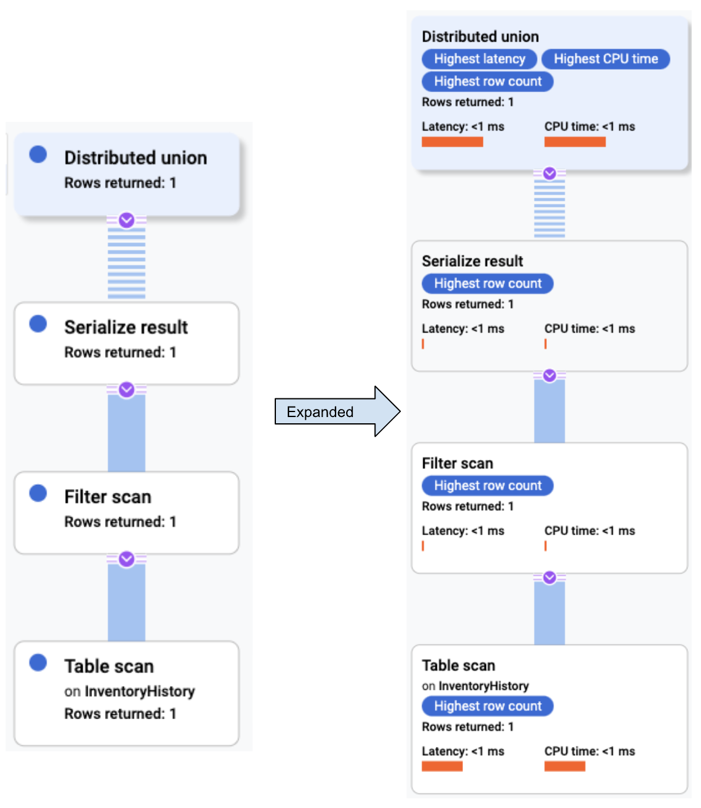
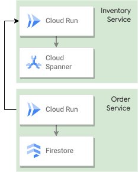
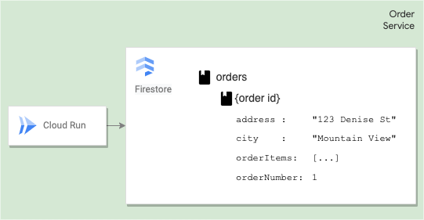
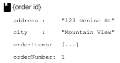
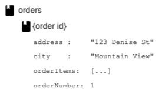
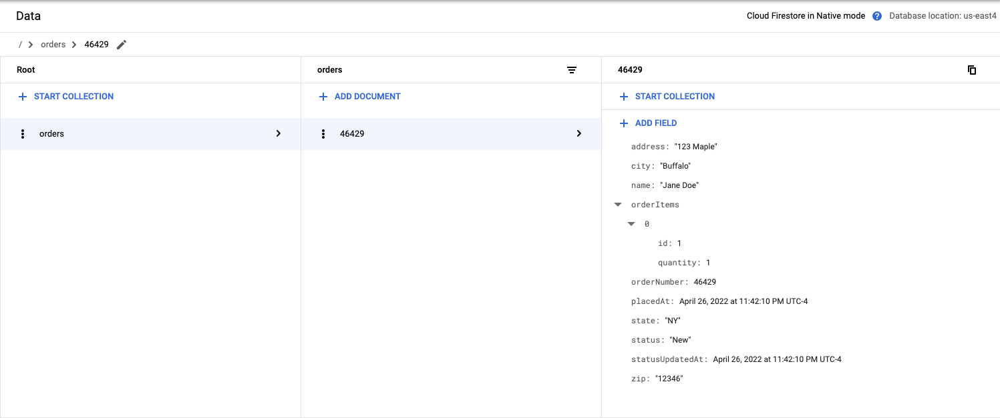

# WORK IN PROGRESS

# How to connect a Node.js application on Cloud Run to a Cloud SQL for PostgreSQL database

# 1. Overview

The [Cloud SQL Node.js connector](https://github.com/GoogleCloudPlatform/cloud-sql-nodejs-connector#readme) is the easiest way to securely connect your Node.js application to your Cloud SQL database. [Cloud Run](https://cloud.google.com/run) is a fully managed serverless platform that enables you to run stateless containers that are invocable via HTTP requests. This Codelab will demonstrate how to connect a Node.js application on Cloud Run to a Cloud SQL for PostgreSQL database securely with a service account using IAM Authentication.

## What you will learn

In this lab, you will learn how to do the following:

- Create a Cloud SQL instance for PostgreSQL database
- Deploy a Node.js application to Cloud Run
- Connect your application to your database using the Cloud SQL Node.js Connector library

## Prerequisites

This lab assumes familiarity with the Cloud Console and Cloud Shell environments.

# 2. Before you begin

## Cloud Project setup

TODO: pull the contents from the previous tutorial

## Environment Setup

Activate Cloud Shell by clicking on the icon to the right of the search bar.

From Cloud Shell, enable the APIs:

```bash
gcloud services enable compute.googleapis.com sqladmin.googleapis.com \
  run.googleapis.com artifactregistry.googleapis.com \
  cloudbuild.googleapis.com servicenetworking.googleapis.com
```

This command may take a few minutes to complete, but it should eventually produce a successful message similar to this one:

```bash
Operation "operations/acf.p2-327036483151-73d90d00-47ee-447a-b600-a6badf0eceae" finished successfully.
```

# 3. Set up a Service Account

Create and configure a Google Cloud service account to be used by Cloud Run so that it has the correct permissions to connect to Cloud SQL.

1. Run the gcloud iam service-accounts create command as follows to create a new service account:

```bash
gcloud iam service-accounts create quickstart-service-account \
  --display-name="Quickstart Service Account"
```

2. Run the gcloud projects add-iam-policy-binding command as follows to add the Cloud SQL Client role to the Google Cloud service account you just created. In Cloud Shell, the expression ${GOOGLE_CLOUD_PROJECT} will be replaced by the name of your project. You can also do this replacement manually if you feel more comfortable with that.

```bash
gcloud projects add-iam-policy-binding ${GOOGLE_CLOUD_PROJECT} \
  --member="serviceAccount:quickstart-service-account@${GOOGLE_CLOUD_PROJECT}.iam.gserviceaccount.com" \
  --role="roles/cloudsql.client"
```

3. Run the gcloud projects add-iam-policy-binding command as follows to add the **Cloud SQL Instance User** role to the Google Cloud service account you just created.

```bash
gcloud projects add-iam-policy-binding ${GOOGLE_CLOUD_PROJECT} \
  --member="serviceAccount:quickstart-service-account@${GOOGLE_CLOUD_PROJECT}.iam.gserviceaccount.com" \
  --role="roles/cloudsql.instanceUser"

```

4. Run the gcloud projects add-iam-policy-binding command as follows to add the **Log Writer** role to the Google Cloud service account you just created.

```bash
gcloud projects add-iam-policy-binding ${GOOGLE_CLOUD_PROJECT} \
  --member="serviceAccount:quickstart-service-account@${GOOGLE_CLOUD_PROJECT}.iam.gserviceaccount.com" \
  --role="roles/logging.logWriter"
```

# 4. Set up Cloud SQL
Run the `gcloud sql instances create` command to create a Cloud SQL instance.

– **-database-version**: The database engine type and version. If left unspecified, the API default is used. See the gcloud database versions documentation to see the current available versions.
– **-cpu**: The number of cores desired in the machine.
– **-memory**: Whole number value indicating how much memory is desired in the machine. A size unit should be provided (for example, 3072MB or 9GB). If no units are specified, GB is assumed.
- **–region**: Regional location of the instance (for example: us-central1, asia-east1, us-east1).
- **–database-flags**: Allows setting flags. In this case, we are turning on cloudsql.iam_authentication to enable Cloud Run to connect to Cloud SQL using the service account we created before.

```bash
gcloud sql instances create quickstart-instance \
  --database-version=POSTGRES_14 \
  --cpu=1 \
  --memory=4GB \
  --region=us-central1 \
  --database-flags=cloudsql.iam_authentication=on

```

This command may take a few minutes to complete.

Run the `gcloud sql databases create` command to create a Cloud SQL database within the `quickstart-instance`.

```bash
gcloud sql databases create quickstart_db \
  --instance=quickstart-instance
```

Create a PostgreSQL database user for the service account you created earlier to access the database.

```bash
gcloud sql users create quickstart-service-account@${GOOGLE_CLOUD_PROJECT}.iam \
  --instance=quickstart-instance \
  --type=cloud_iam_service_account
```

# 5. Prepare Application

Prepare a Node.js application that responds to HTTP requests.

1. In Cloud Shell create a new directory named `helloworld`, then change into that directory:

```bash
mkdir helloworld
cd helloworld
```

2. Initialize a `package.json` file as a module.
```bash
npm init -y
npm pkg set type="module"
npm pkg set main="index.mjs"
npm pkg set scripts.start="node index.mjs"
```

3. Install the Cloud SQL Node.js connector dependency.

```bash
npm install @google-cloud/cloud-sql-connector
```

4. Install `pg` to interact with the PostgreSQL database.

```bash
npm install pg
```

5. Install express accept incoming http requests.

```bash
npm install express
```

6. Create an `index.mjs` file with the application code. This code is able to:

- Accept HTTP requests
- Connect to the database
- Store the time of the HTTP request in the database
- Return the times of the last five requests

Run the following command in Cloud Shell:

```bash
cat > index.mjs << "EOF"
import express from 'express';
import pg from 'pg';
import {Connector} from '@google-cloud/cloud-sql-connector';

const {Pool} = pg;

const connector = new Connector();
const clientOpts = await connector.getOptions({
    instanceConnectionName: process.env.INSTANCE_CONNECTION_NAME,
    authType: 'IAM'
});

const pool = new Pool({
    ...clientOpts,
    user: process.env.DB_USER,
    database: process.env.DB_NAME
});

const app = express();

app.get('/', async (req, res) => {
  await pool.query('INSERT INTO visits(created_at) VALUES(NOW())');
  const {rows} = await pool.query('SELECT created_at FROM visits ORDER BY created_at DESC LIMIT 5');
  console.table(rows); // prints the last 5 visits
  res.send(rows);
});

const port = parseInt(process.env.PORT) || 8080;
app.listen(port, async () => {
  console.log('process.env: ', process.env);
  await pool.query(`CREATE TABLE IF NOT EXISTS visits (
    id SERIAL NOT NULL,
    created_at timestamp NOT NULL,
    PRIMARY KEY (id)
  );`);
  console.log(`helloworld: listening on port ${port}`);
});

EOF
```

This code creates a basic web server that listens on the port defined by the PORT environment variable. The application is now ready to be deployed.

# 6. Deploy Cloud Run Application

Run the command below to deploy your application to Cloud Run:

- **–region**: Regional location of the instance (for example: us-central1, asia-east1, us-east1).
- **–source**: The source code to be deployed. In this case, . refers to the source code in the current folder helloworld.
- **–set-env-vars**: Sets environment variables used by the application to direct the application to the Cloud SQL database.
- **–service-account**: Ties the Cloud Run deployment to the service account with permissions to connect to the Cloud SQL database created at the beginning of this Codelab.
- **–allow-unauthenticated**: Allows unauthenticated requests so that the application is accessible from the internet.

```bash
gcloud run deploy helloworld \
  --region=us-central1 \
  --source=. \
  --set-env-vars INSTANCE_CONNECTION_NAME="${GOOGLE_CLOUD_PROJECT}:us-central1:quickstart-instance" \
  --set-env-vars DB_NAME="quickstart_db" \
  --set-env-vars DB_USER="quickstart-service-account@${GOOGLE_CLOUD_PROJECT}.iam" \
  --service-account="quickstart-service-account@${GOOGLE_CLOUD_PROJECT}.iam.gserviceaccount.com" \
  --allow-unauthenticated
```

If prompted, press `**y**` and `**Enter**` to confirm that you would like to continue:

```bash
Do you want to continue (Y/n)? y
```

After a few minutes, the application should provide a URL for you to visit.

Navigate to the URL to see your application in action. Every time you visit the URL or refresh the page, you will see the five most recent visits returned as JSON.

# 7. Congratulations

You have deployed a Node.js application on Cloud Run taht is able to connect to a PostgreSQL database running on Cloud SQL.

## What we've covered:
- Creating a Cloud SQL for PostgreSQL database
- Deploying a Node.js application to Cloud Run
- Connecting your application to Cloud SQL using the Cloud SQL Node.js Connector

## Clean up
To avoid incurring charges to your Google Cloud account for the resources used in this tutorial, either delete the project that contains the resources, or keep the project and delete the individual resources. If you would like to delete the entire project, you can run:

```bash
gcloud projects delet ${GOOGLE_CLOUD_PROJECT}
```

# Connecting to Fully Managed Databases from Cloud Run

# 1. Overview
In this lab, you will integrate serverless databases(Spanner and Firestore) with applications(Go and Node.js) running in Cloud Run. The Cymbal Eats application includes multiple services which run on Cloud Run. In the following steps, you will configure services to use the [Cloud Spanner](https://cloud.google.com/spanner) relational database and [Cloud Firestore](https://cloud.google.com/firestore), a NoSQL document database. Utilizing serverless products for the data tier and the application runtime allows you to abstract away all infrastructure management, focusing on building your application instead of worrying about overhead.

# 2. What you will learn
In this lab, you will learn how to do the following:

- Integrate Spanner
- Enable Spanner Managed Services
- Integrate into code
- Deploy code connecting to Spanner
- Integrate Firestore
- Enable Firestore Managed Services
- Integrate into code
- Deploy code connecting to Firestore

# 3. Setup and Requirements

## Self-paced environment setup

[WIP]

## Setup Environment

1. Create a project ID variable

```bash
export PROJECT_ID=$(gcloud config get-value project)
export PROJECT_NUMBER=$(gcloud projects describe $PROJECT_ID --format='value(projectNumber)')
export SPANNER_INSTANCE=inventory-instance
export SPANNER_DB=inventory-db
export REGION=us-east1
export SPANNER_CONNECTION_STRING=projects/$PROJECT_ID/instances/$SPANNER_INSTANCE/databases/$SPANNER_DB
```

2. Enable Spanner, Cloud Run, Cloud Build, and Artifact Registry APIs

```bash
gcloud services enable \
     compute.googleapis.com \
     spanner.googleapis.com \
     run.googleapis.com \
     cloudbuild.googleapis.com \
     artifactregistry.googleapis.com \
     firestore.googleapis.com \
     appengine.googleapis.com \
     artifactregistry.googleapis.com
```

3. Clone the repository

```bash
git clone https://github.com/GoogleCloudPlatform/cymbal-eats.git
```

4. Navigate into the directory

```bash
cd cymbal-eats/inventory-service/spanner
```

# 4. Create and Configure a Spanner instance

Spanner is the inventory services backend relational database. You will create a Spanner instance, database, and schema in the following steps.

## Create an instance
1. Create a Cloud Spanner instance
```bash
gcloud spanner instances create $SPANNER_INSTANCE --config=regional-${REGION} \
--description="Cymbal Menu Inventory" --nodes=1
```
Example Output
```
Creating instance...done.
```

2. Verify if the Spanner instance is correctly configured

```bash
gcloud spanner instances list
```

Example output
```
NAME: inventory-instance
DISPLAY_NAME: Cymbal Menu Inventory
CONFIG: regional-us-east1
NODE_COUNT: 1
PROCESSING_UNITS: 100
STATE: READY
```

## Create a database and schema

Create a new database and use [Google standard SQL's data definition language(DDL)](https://cloud.google.com/spanner/docs/reference/standard-sql/data-definition-language) to create the database schema.

1. Create a DDL file

```bash
echo "CREATE TABLE InventoryHistory (ItemRowID STRING (36) NOT NULL, ItemID INT64 NOT NULL, InventoryChange INT64, Timestamp TIMESTAMP) PRIMARY KEY(ItemRowID)" >> table.ddl
```

2. Create the Spanner database

```bash
gcloud spanner databases create $SPANNER_DB \
--instance=$SPANNER_INSTANCE \
--ddl-file=table.ddl
```

Example output

```
Creating database...done.
```

## Verify Database state and schema

1. View the state of the database

```bash
gcloud spanner databases describe $SPANNER_DB \
--instance=$SPANNER_INSTANCE
```

Example output

```
createTime: '2022-04-22T15:11:33.559300Z'
databaseDialect: GOOGLE_STANDARD_SQL
earliestVersionTime: '2022-04-22T15:11:33.559300Z'
encryptionInfo:
- encryptionType: GOOGLE_DEFAULT_ENCRYPTION
name: projects/cymbal-eats-7-348013/instances/menu-inventory/databases/menu-inventory
state: READY
versionRetentionPeriod: 1h
```

> Note: The database's state shows as READY

2. View the schema of the database

```bash
gcloud spanner databases ddl describe $SPANNER_DB \
--instance=$SPANNER_INSTANCE
```

Example output

```
CREATE TABLE InventoryHistory (
  ItemRowID STRING(36) NOT NULL,
  ItemID INT64 NOT NULL,
  InventoryChange INT64,
  TimeStamp TIMESTAMP,
) PRIMARY KEY(ItemRowID);
```

> **Note**: The database has four columns. The ItemRowID is the primary key.
> You can also view the details in the [Spanner Overview Console](https://console.cloud.google.com/spanner/instances/inventory-instance/details/databases)

# 5. Integration Spanner

In this section, you will learn how to integrate Spanner into your application. In addition, SQL Spanner provides [Client libraries](https://cloud.google.com/spanner/docs/reference/libraries), [JDBC drivers](https://cloud.google.com/spanner/docs/jdbc-drivers), [R2DBC drivers](https://cloud.google.com/spanner/docs/use-oss-r2dbc), [REST APIs](https://cloud.google.com/spanner/docs/reference/rest) and [RPC APIs](https://cloud.google.com/spanner/docs/reference/rpc), which allow you to integrate Spanner into any application.

In the next section, you will use the Go client library to install, authenticate and modify data in Spanner.

## Installing the client library

The [Cloud Spanner client library](https://cloud.google.com/spanner/docs/reference/libraries#create-service-account-gcloud) makes it easier to integrate with Cloud Spanner by automatically using Application Default Credentials (ADC) to find your service account credentials

> Note: The starter code will have errors as you update the code. You can ignore these errors.

## Set up authentication

The Google Cloud CLI and Google Cloud client libraries automatically detect when they are running on Google Cloud and use the runtime service account of the current Cloud Run revision. This strategy is called Application Default Credentials and enables code portability across multiple environments.

However, it's best to create a dedicated identity by assigning it a user-managed service account instead of the default service account.

1. Grant the Spanner Database Admin role to the service account

```bash
gcloud projects add-iam-policy-binding $PROJECT_ID \
--member="serviceAccount:$PROJECT_NUMBER-compute@developer.gserviceaccount.com" \
--role="roles/spanner.databaseAdmin"
```

Example output
```
Updated IAM policy for project [cymbal-eats-6422-3462].
[...]
```

> With the Spanner Database Admin role, the service account can:
> - Get/list all Cloud Spanner instances in the project.
> - Create/list/drop databases in an instance.
> - Grant/revoke access to databases in the project.
> - Read from and write to all Cloud Spanner databases in the project.

## Using client libraries

The Spanner client libraries abstract the complexities of integrating with Spanner and are available in many popular programming languages.

### Create a Spanner client

The Spanner client is a client for reading and writing data to a Cloud Spanner database. A client is safe to use concurrently, except for its Close method.

The snippet below creates a spanner client

**[main.go](https://github.com/GoogleCloudPlatform/cymbal-eats/blob/main/inventory-service/spanner/main.go#L47-L61)**

```golang
var dataClient *spanner.Client
...
dataClient, err = spanner.NewClient(ctx, databaseName)
```

You can think of a Client as a database connection: all your interactions with Cloud Spanner must go through a Client. Typically you create a Client when your application starts up, and then you re-use that client to read, write, and execute transactions. Each client uses resources in Cloud Spanner.

## Modify data

There are multiple ways to insert, update and delete data from a Spanner database. Listed below are the available methods.

- [Google Cloud Console](https://cloud.google.com/spanner/docs/modify-data)
- [gcloud CLI](https://cloud.google.com/spanner/docs/modify-gcloud)
- [DML](https://cloud.google.com/spanner/docs/modify-gcloud#modifying_data_using_dml)
- [Mutations](https://cloud.google.com/spanner/docs/modify-mutation-api)

In this lab, you will use mutations to modify data

## Mutations in Spanner

A [Mutation](https://pkg.go.dev/cloud.google.com/go/spanner/#Mutation) is a container for mutation operations. A Mutation represents a sequence of inserts, updates, and deletes that Cloud Spanner applies atomically to different rows and tables in a Cloud Spanner database.

**[main.go](https://github.com/GoogleCloudPlatform/cymbal-eats/blob/main/inventory-service/spanner/main.go#L148-L153)**

```golang
m := []*spanner.Mutation{}

m = append(m, spanner.Insert(
        "inventoryHistory",
         inventoryHistoryColumns,
        []interface{}{uuid.New().String(), element.ItemID, element.InventoryChange, time.Now()}))
```

The snippet of code inserts a new row into the inventory history table.

## Deploying and Testing

Now that Spanner is configured and you've reviewed the key code elements deploy the application to Cloud Run.

## Deploy the application to Cloud Run

Cloud Run can automatically build, push and deploy your code with a single command. In the following command, you'll call the `deploy` command on the `run` service, passing in variables used by the running application such as SPANNER_CONNECTION_STRING that you created earlier.

1. Click Open Terminal
2. Deploy the inventory service to Cloud Run

```bash
gcloud run deploy inventory-service \
    --source . \
    --region $REGION \
    --update-env-vars SPANNER_CONNECTION_STRING=$SPANNER_CONNECTION_STRING \
    --allow-unauthenticated \
    --project=$PROJECT_ID \
    --quiet
```

Example output

```
Service [inventory-service] revision [inventory-service-00001-sug] has been deployed and is serving 100 percent of traffic.
Service URL: https://inventory-service-ilwytgcbca-uk.a.run.app
```

> **Note**: If prompted to continue type ‘Y'

3. Store the service URL

```bash
INVENTORY_SERVICE_URL=$(gcloud run services describe inventory-service \
  --platform managed \
  --region $REGION \
  --format=json | jq \
  --raw-output ".status.url")
```

## Test the Cloud Run application

### Insert an item

In cloudshell, enter the following command.

```bash
POST_URL=$INVENTORY_SERVICE_URL/updateInventoryItem
curl -i -X POST ${POST_URL} \
--header 'Content-Type: application/json' \
--data-raw '[
    {
        "itemID": 1,
        "inventoryChange": 5
    }
]'
```

Example output

```
HTTP/2 200
access-control-allow-origin: *
content-type: application/json
x-cloud-trace-context: 10c32f0863d26521497dc26e86419f13;o=1
date: Fri, 22 Apr 2022 21:41:38 GMT
server: Google Frontend
content-length: 2

OK
```

## Query an item

1. Query the inventory service

```
GET_URL=$INVENTORY_SERVICE_URL/getAvailableInventory
curl -i ${GET_URL}
```

Example response

```
HTTP/2 200
access-control-allow-origin: *
content-type: text/plain; charset=utf-8
x-cloud-trace-context: b94f921e4c2ae90210472c88eb05ace8;o=1
date: Fri, 22 Apr 2022 21:45:50 GMT
server: Google Frontend
content-length: 166

[{"ItemID":1,"Inventory":5}]
```

# 6. Spanner Concepts

Cloud Spanner queries its databases using declarative SQL statements. SQL statements indicate what the user wants without describing how the results will be obtained.

1. In the terminal, enter this command to query the table for the record previously created.

```bash
gcloud spanner databases execute-sql $SPANNER_DB \
--instance=$SPANNER_INSTANCE \
--sql='SELECT * FROM InventoryHistory WHERE ItemID=1'
```

Example output

```
ItemRowID: 1
ItemID: 1
InventoryChange: 3
Timestamp:
```

## Query execution plans

A [query execution plan](https://cloud.google.com/spanner/docs/query-execution-plans) is a series of steps Spanner uses to obtain results. There may be several ways to acquire the results of a particular SQL statement. Query execution plans are accessible in the console and the client libraries. To see how Spanner handles SQL queries:

1. In the console, open the Cloud Spanner instances page.
2. Go to Cloud Spanner instances
3. Click the name of the Cloud Spanner instance. From the databases section, select the database you want to query.
4. Click Query.
5. Enter the following query in the query editor

```sql
SELECT * FROM InventoryHistory WHERE ItemID=1
```

6. Click RUN
7. Click EXPLANATION

The Cloud Console displays a visual execution plan for your query.



> Conceptually, an execution plan is a tree of relational operators. Each operator reads rows from its input(s) and produces output rows. The root of the execution is returned as the result of the SQL query.

## Query optimizer

The Cloud Spanner query optimizer compares alternative execution plans and selects the most efficient one. Over time, the query optimizer will evolve, broadening the choices in the query execution plan and improving the accuracy of the estimates that inform those choices, leading to more efficient query execution plans.

Cloud Spanner rolls out optimizer updates as new query optimizer versions. By default, each database starts using the latest version of the optimizer no sooner than 30 days after that version has been released.

To see the version used when running a query in gcloud spanner, set the –query-mode flag to PROFILE

1. Enter the following command to view the optimizer version

```bash
gcloud spanner databases execute-sql $SPANNER_DB --instance=$SPANNER_INSTANCE \
--query-mode=PROFILE --sql='SELECT * FROM InventoryHistory'
```

Example output

```
TOTAL_ELAPSED_TIME: 6.18 msecs
CPU_TIME: 5.17 msecs
ROWS_RETURNED: 1
ROWS_SCANNED: 1
OPTIMIZER_VERSION: 3
 RELATIONAL Distributed Union
 (1 execution, 0.11 msecs total latency)
 subquery_cluster_node: 1
    |
    +- RELATIONAL Distributed Union
    |  (1 execution, 0.09 msecs total latency)
    |  call_type: Local, subquery_cluster_node: 2
    |   |
    |   \- RELATIONAL Serialize Result
    |      (1 execution, 0.08 msecs total latency)
    |       |
    |       +- RELATIONAL Scan
    |       |  (1 execution, 0.08 msecs total latency)
    |       |  Full scan: true, scan_target: InventoryHistory, scan_type: TableScan
    |       |   |
    |       |   +- SCALAR Reference
    |       |   |  ItemRowID
    |       |   |
    |       |   +- SCALAR Reference
    |       |   |  ItemID
    |       |   |
    |       |   +- SCALAR Reference
    |       |   |  InventoryChange
    |       |   |
    |       |   \- SCALAR Reference
    |       |      Timestamp
    |       |
    |       +- SCALAR Reference
    |       |  $ItemRowID
    |       |
    |       +- SCALAR Reference
    |       |  $ItemID
    |       |
    |       +- SCALAR Reference
    |       |  $InventoryChange
    |       |
    |       \- SCALAR Reference
    |          $Timestamp
    |
    \- SCALAR Constant
       true

ItemRowID: 1
ItemID: 1
InventoryChange: 3
Timestamp:
```

> The current version is set to version 3. To find the newest version check the [version history](https://cloud.google.com/spanner/docs/query-optimizer/overview#version-history)

### Update the optimizer version

The newest version at the time of this lab is version 4. Next, you will update the Spanner Table to use version 4 for the query optimizer.

2. Update the optimizer

```bash
gcloud spanner databases ddl update $SPANNER_DB \
--instance=$SPANNER_INSTANCE \
--ddl='ALTER DATABASE InventoryHistory
SET OPTIONS (optimizer_version = 4)'
```

Example ouput

```
Schema updating...done.
```

3. Enter the following command to view the optimizer version update

```bash
gcloud spanner databases execute-sql $SPANNER_DB --instance=$SPANNER_INSTANCE \
--query-mode=PROFILE --sql='SELECT * FROM InventoryHistory'
```

Example output

```
TOTAL_ELAPSED_TIME: 8.57 msecs
CPU_TIME: 8.54 msecs
ROWS_RETURNED: 1
ROWS_SCANNED: 1
OPTIMIZER_VERSION: 4
[...]
```

> The `OPTIMIZER_VERSION` has been updated to version 4

### Visualize query optimizer version in Metrics Explorer

You can use Metrics Explorer in Cloud Console to visualize the **Count of queries** for your database instance. You can see which optimizer version is being used in each database.

1. Navigate to the Monitoring in the Cloud Console and select [Metrics Explorer](https://cloud.google.com/monitoring/charts/metrics-explorer#find-me) in the left menu.

2. In the **Resource type** field, select Cloud Spanner Instance.

3. In the **Metric** field, select Count of queries and Apply.

4. In the **Group By** field, select database, optimizer_version, and status.


# 7. Create and Configure a Firestore Database

Firestore is a NoSQL document database built for automatic scaling, high performance, and ease of application development. While the Firestore interface has many of the same features as traditional databases, a NoSQL database differs from them in describing relationships between data objects.

The following task will guide you through creating an ordering service Cloud Run application backed by Firestore. The ordering service will call the inventory service created in the previous section to query the Spanner database before starting the order. This service will ensure sufficient inventory exists and the order can be filled.



# 8. Firestore Concept

## Data Model

A Firestore database is made up of collections and documents.



### Documents

Each document contains a set of key-value pairs. Firestore is optimized for storing large collections of small documents.



> In the example above, the order id document contains four key-value pairs. The key orderItems include an array of key-value pairs.

### Collections

You must store all documents in collections. Documents can contain subcollections and nested objects, including primitive fields like strings or complex objects like lists.



> The order id document is stored in the orders collection in the example above.

## Create a Firestore database

1. Create the Firestore database

```bash
gcloud firestore databases create --location=$REGION
```

Example ouput

```
Success! Selected Google Cloud Firestore Native database for cymbal-eats-6422-3462
```

> The new Firestore database you created is currently empty. The new database also has a default set of security rules that allow anyone to perform read operations and prevent anyone from writing to the database.

# 9. Integrating Firestore into your application

In this section, you will update the service account, add Firestore access service accounts, review and deploy the Firestore security rules and review how data is modified in Firestore.

## Set up authentication

1. Grant the Datastore user role to the service account

```bash
gcloud projects add-iam-policy-binding $PROJECT_ID \
  --member="serviceAccount:$PROJECT_NUMBER-compute@developer.gserviceaccount.com" \
  --role="roles/datastore.user"
```

Example output

```
Updated IAM policy for project [cymbal-eats-6422-3462].
```

> The Datastore user role grants read/write access to data in a Firestore database.

### Firestore Security Rules

Security rules provide access control and data validation expressive yet straightforward format.

1. Navigate to the order-service/starter-code directory

```bash
cd ~/cymbal-eats/order-service
```

2. Open the firestore.rules file in cloud editor

```bash
cat firestore.rules
```

**[firestore.rules](https://github.com/GoogleCloudPlatform/cymbal-eats/blob/main/order-service/firestore.rules)**

```
rules_version = '2';
service cloud.firestore {
  match /databases/{database}/documents { ⇐ All database
    match /{document=**} { ⇐ All documents
      allow read: if true; ⇐ Allow reads
    }
    match /{document=**} {
      allow write: if false; ⇐ Deny writes
    }
  }
}
```

> The firestore.rules file contains rules to allow all read operations and denies all write operations for all tables in the Firestore database. For more information on firestore rules, review [Getting started with security rules](https://cloud.google.com/firestore/docs/security/get-started).

**Warning**: It is best practice to limit access to Firestore storage. For the purpose of this lab, all reads are allowed. This is not an advised production configuration.

## Enable Firestore Managed Services

1. Click Open Terminal

2. Create .firebaserc file with the current Project ID. The settings for deploy targets are stored in the .firebaserc file in your project directory.

**[firebaserc.tmpl](https://github.com/GoogleCloudPlatform/cymbal-eats/blob/main/order-service/firebaserc.tmpl)**

```bash
sed "s/PROJECT_ID/$PROJECT_ID/g" firebaserc.tmpl > .firebaserc
```

2. Download firebase binary

```bash
curl -sL https://firebase.tools | upgrade=true bash
```

Example output

```
-- Checking for existing firebase-tools on PATH...
Your machine already has firebase-tools@10.7.0 installed. Nothing to do.
-- All done!
```

3. Deploy Firestore rules.

```bash
firebase deploy
```

Example Output

```
=== Deploying to 'cymbal-eats-6422-3462'...

i  deploying firestore
i  cloud.firestore: checking firestore.rules for compilation errors...
✔  cloud.firestore: rules file firestore.rules compiled successfully
i  firestore: uploading rules firestore.rules...
✔  firestore: released rules firestore.rules to cloud.firestore

✔  Deploy complete!

Project Console: https://console.firebase.google.com/project/cymbal-eats-6422-3462/overview
```

> Updates to Cloud Firestore Security Rules can take up to a minute to affect new queries and listeners. However, it can take up to 10 minutes to fully propagate the changes and affect any active listeners.

## Modify data

Collections and documents are created implicitly in Firestore. Simply assign data to a document within a collection. If either the collection or document does not exist, Firestore creates it.

### Add data to firestore

There are several ways to write data to Cloud Firestore:

- Set the data of a document within a collection, explicitly specifying a document identifier.
- Add a new document to a collection. In this case, Cloud Firestore automatically generates the document identifier.
- Create an empty document with an automatically generated identifier, and assign data to it later.

The next section will guide you through creating a document using the set method.

### Set a document
Use the `set()` method to create a document. With the `set()` method, you must specify an ID for the document to create.

Take a look at the code snippet below.

**[index.js](https://github.com/GoogleCloudPlatform/cymbal-eats/tree/main/order-service/index.js#L89-L102)**

```javascript
const orderDoc = db.doc(`orders/123`);
await orderDoc.set({
    orderNumber: 123,
    name: Anne,
    address: 555 Bright Street,
    city: Mountain View,
    state: CA,
    zip: 94043,
    orderItems: [id: 1],
    status: 'New'
  });
```

This code will create a document specifying a user-generated document id 123. To have Firestore generate an ID on your behalf, use the `add()` or `create()` method.

> When using `set()` if the document does not exist, it will be created. If the document does exist, its contents will be overwritten with the newly provided data.

### Update a documents

The update method `update()` allows you to update some document fields without overwriting the entire document.

In the snippet below, the code updates order 123

**[index.js](https://github.com/GoogleCloudPlatform/cymbal-eats/tree/main/order-service/index.js#L62-L63)**

```javascript
const orderDoc = db.doc(`orders/123`);
await orderDoc.update(name: "Anna");
```

### Delete a documents

In Firestore, you can delete collections, documents or specific fields from a document. To delete a document, use the `delete()` method.

The snippet below deletes order 123.

**[index.js](https://github.com/GoogleCloudPlatform/cymbal-eats/tree/main/order-service/index.js#L50-L51)**

```javascript
const orderDoc = db.doc(`orders/123`);
await orderDoc.delete();
```

> **Note**: Deleting a document does not delete its subcollections!

# 10. Deploying and Testing

In this section, you will deploy the application to Cloud Run and test the create, update and delete methods.

## Deploy the application to Cloud Run

1. Store the URL in the variable INVENTORY_SERVICE_URL to integrate with Inventory Service

```bash
INVENTORY_SERVICE_URL=$(gcloud run services describe inventory-service \
 --region=$REGION \
 --format=json | jq \
 --raw-output ".status.url")
```

> The order service needs to communicate with the inventory service to verify inventory exists, and orders can be fulfilled. In this step, you store the inventory service URL to a variable that will be passed to the order service as an environment variable.

2. Deploy the order service

```bash
gcloud run deploy order-service \
  --source . \
  --platform managed \
  --region $REGION \
  --allow-unauthenticated \
  --project=$PROJECT_ID \
  --set-env-vars=INVENTORY_SERVICE_URL=$INVENTORY_SERVICE_URL \
  --quiet
```

Example output

```
[...]
Done.
Service [order-service] revision [order-service-00001-qot] has been deployed and is serving 100 percent of traffic.
Service URL: https://order-service-3jbm3exegq-uk.a.run.app
```

## Test the Cloud Run application

### Create a document

1. Store the order service application's URL into a variable for testing

```bash
ORDER_SERVICE_URL=$(gcloud run services describe order-service \
  --platform managed \
  --region $REGION \
  --format=json | jq \
  --raw-output ".status.url")
```

2. Build an order request and post a new order to the Firestore database

```bash
curl --request POST $ORDER_SERVICE_URL/order \
--header 'Content-Type: application/json' \
--data-raw '{
    "name": "Jane Doe",
         "email": "Jane.Doe-cymbaleats@gmail.com",
    "address": "123 Maple",
    "city": "Buffalo",
    "state": "NY",
    "zip": "12346",
    "orderItems": [
        {
            "id": 1
        }
    ]
}'
```

Example output

```
{"orderNumber":46429}
```

### Save the Order Number for later use

```bash
export ORDER_NUMBER=<value_from_output>
```

### View results

View the results in Firestore

1. Navigate to the [Firestore console](https://console.cloud.google.com/firestore)

2. Click on Data


## Update a document

The order submitted didn't include the quantity.

1. Update the record and add a quantity key-value pair

```bash
curl --location -g --request PATCH $ORDER_SERVICE_URL/order/${ORDER_NUMBER} \
--header 'Content-Type: application/json' \
--data-raw '{
"orderItems": [
        {
            "id": 1,
            "quantity": 1
        }
    ]
}'
```

Example output

```
{"status":"success"}
```

### View results
View the results in Firestore

1. Navigate to the [Firestore console](https://console.cloud.google.com/firestore)

2. Click on Data



> When updating the NoSQL structure in Firestore using patch(), only the items which are passed in the call are updated.

## Delete a document

1. Delete item 46429 from the Firestore orders collection

```bash
curl --location -g --request DELETE $ORDER_SERVICE_URL/order/${ORDER_NUMBER}
```

### View results
Navigate to the Firestore console

1. Navigate to the [Firestore console](https://console.cloud.google.com/firestore)

2. Click on Data


> Document 46429 has been deleted, but the orders collections remain.

# 11. Congratulations!

Congratulations, you finished the lab!

What's next:
Explore other Cymbal Eats codelabs:

- [Triggering Cloud Workflows with Eventarc](https://codelabs.developers.google.com/eventarc-workflows-cloud-run)
- [Triggering Event Processing from Cloud Storage](https://codelabs.developers.google.com/triggering-cloud-functions-from-cloud-storage)
- [Connecting to Private CloudSQL from Cloud Run](https://codelabs.developers.google.com/connecting-to-private-cloudsql-from-cloud-run)
- [Secure Serverless Application with Identity Aware Proxy (IAP)](https://codelabs.developers.google.com/secure-serverless-application-with-identity-aware-proxy)
- [Triggering Cloud Run Jobs with Cloud Scheduler](https://codelabs.developers.google.com/cloud-run-jobs-and-cloud-scheduler)
- [Securely Deploying to Cloud Run](https://codelabs.developers.google.com/secure-cloud-run-deployment)
- [Securing Cloud Run Ingress Traffic](https://codelabs.developers.google.com/cloud-run-ingress-deployment)
- [Connecting to private AlloyDB from GKE Autopilot](https://codelabs.developers.google.com/connecting-to-private-alloydb-from-gke-autopilot)

## Clean up

To avoid incurring charges to your Google Cloud account for the resources used in this tutorial, either delete the project that contains the resources, or keep the project and delete the individual resources.

### Deleting the project

The easiest way to eliminate billing is to delete the project that you created for the tutorial.
